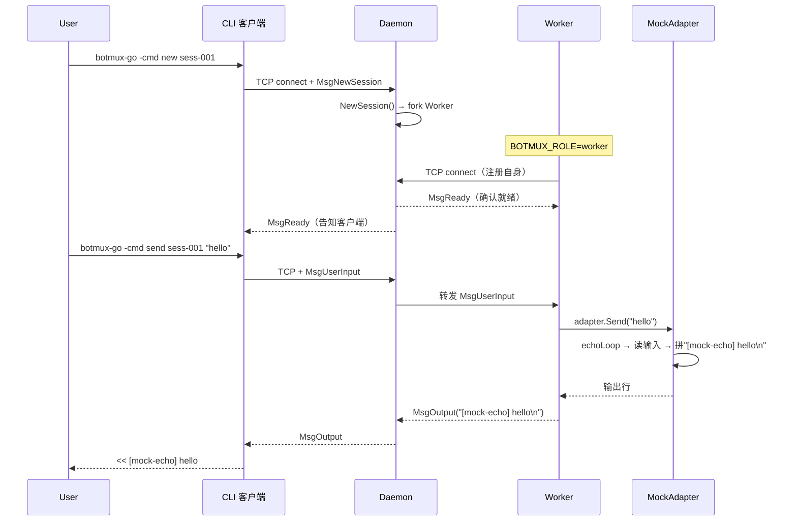
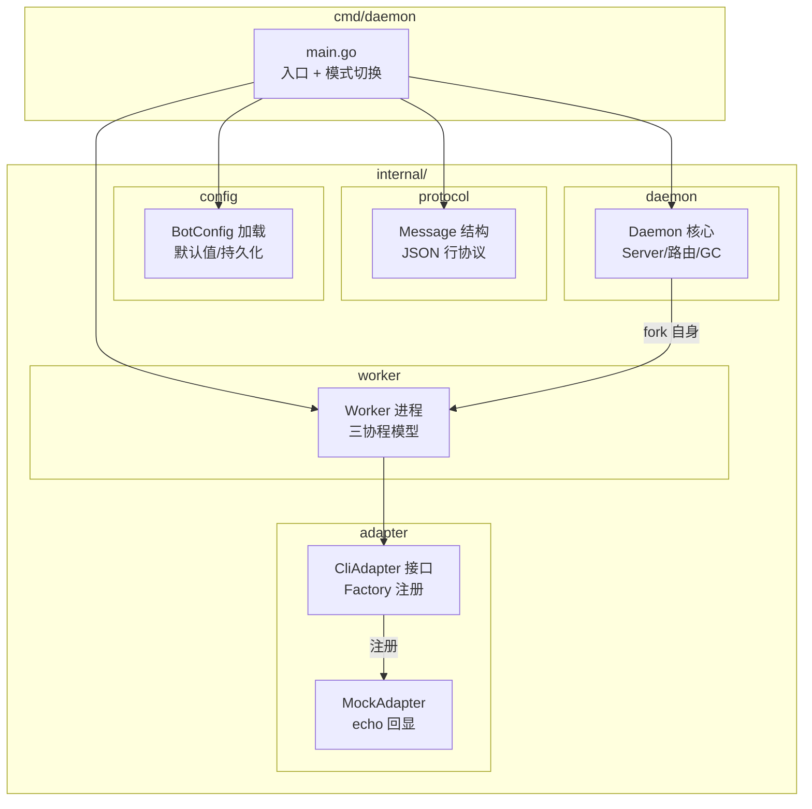

# botmux-go v1 学习笔记

> 基于 TypeScript 版 `botmux` 的 Go 语言重构学习记录
> 版本：V1 脚手架 | 日期：2026-08-06
> 目标：理解 "AI CLI + IM 桥接服务" 的核心架构

---

## 一、项目概览

### 1.1 什么是 botmux-go

botmux-go 是一个 **AI CLI 智能中枢**，它的核心职责是：

```
飞书/Lark 消息  <->  botmux-go  <->  AI CLI (codex/cursor/claude)
```

- 接收 IM 消息，路由给对应的 AI CLI 会话
- 管理多个并行的 AI CLI 会话（每个话题/会话一个 Worker）
- 把 AI CLI 的终端输出实时回传到 IM 卡片
- 隔离不同 Bot 的配置、权限和资源

### 1.2 技术选型

| 维度 | 选择 | 理由 |
|------|------|------|
| 语言 | Go 1.23 | 高并发、强类型、静态编译、无运行时开销 |
| 依赖 | 0 第三方库 | 纯标准库，避免依赖地狱，加深对底层的理解 |
| 通信 | TCP + JSON 行协议 | 简单可靠，跨平台，便于调试 |
| 进程模型 | Daemon + Worker | 对应 TS 版的 daemon + worker-pool |

### 1.3 与 TS 版的对照

| TS 模块 | Go 模块 | 说明 |
|---------|---------|------|
| `src/daemon.ts` | `internal/daemon/daemon.go` | Daemon 核心编排 |
| `src/core/worker-pool.ts` | `internal/daemon/daemon.go#Lsessions` | Worker 池管理 |
| `src/worker.ts` | `internal/worker/worker.go` | Worker 进程逻辑 |
| `src/adapters/cli/registry.ts` | `internal/adapter/adapter.go` | CLI Adapter 注册中心 |
| `src/adapters/cli/codex.ts` | `internal/adapter/mock.go` | Adapter 实现（目前只有 Mock） |
| `src/config/bots.json` | `configs/bots.json` | 多 Bot 配置 |
| `src/im/lark/event-dispatcher.ts` | `cmd/daemon/main.go#execCommand` | 事件分发（V1 用 TCP 模拟） |

---

## 二、架构图

### 2.1 整体架构（进程与数据流）

```mermaid
flowchart TD
    subgraph 外部调用
        CLI["CLI 客户端<br/>(botmux-go -cmd new/send)"]
    end

    subgraph Daemon 进程
        TCP_Server["TCP Server<br/>(:17890)"]
        SessionMgr["会话管理<br/>sessions map"]
        Routing["消息路由<br/>Client ↔ Worker"]
        GC["周期 GC<br/>心跳/空闲检测"]
    end

    subgraph Worker 进程 (fork 自 Daemon)
        Adapter["CLI Adapter<br/>(Mock / Codex)"]
        Backend["终端后端<br/>(pty / tmux)"]
        IOLoop["IO 循环<br/>读 Daemon ↔ 写 CLI"]
    end

    subgraph 真实 CLI
        RealCLI["AI CLI<br/>(codex / claude)"]
    end

    CLI -- "TCP/JSON" --> TCP_Server
    TCP_Server --> SessionMgr
    SessionMgr --> Routing
    Routing -- "fork 自身二进制<br/>BOTMUX_ROLE=worker" --> Worker
    Worker -- "TCP/JSON" --> TCP_Server
    Worker --> Adapter
    Adapter --> Backend
    Backend --> RealCLI
    RealCLI -- "输出流" --> Backend
    Backend -- "读行" --> IOLoop
    IOLoop -- "MsgOutput" --> Daemon
    Daemon -- "MsgOutput" --> CLI
    GC -- "超时清理" --> SessionMgr
```

### 2.2 消息时序（创建会话 → 发送消息 → 回显）



### 2.3 分层架构（代码组织）



### 2.4 进程模型详解

```
┌─────────────────────────────────────────────────┐
│                 Daemon 进程                      │
│  ┌───────────┐   ┌───────────┐   ┌───────────┐  │
│  │TCP Server │──▶│SessionMgr │──▶│  Router   │  │
│  └───────────┘   └───────────┘   └─────┬─────┘  │
│       ▲                                │         │
│       │                                ▼         │
│  ┌────┴─────┐                  ┌───────────┐     │
│  │  GC 协程  │                  │ Worker 1  │     │
│  └──────────┘                  │ Worker 2  │     │
│                                │ Worker N  │     │
│                                └─────┬─────┘     │
│                                      │           │
└──────────────────────────────────────┼───────────┘
                                       │ fork
                                       ▼
┌─────────────────────────────────────────────────┐
│                 Worker 进程                      │
│  ┌───────────┐   ┌───────────┐   ┌───────────┐  │
│  │读 Daemon  │   │读 CLI 输出│   │  心跳    │  │
│  │协程       │   │协程       │   │  协程    │  │
│  └─────┬─────┘   └─────┬─────┘   └───────────┘  │
│        │               │                         │
│        ▼               ▼                         │
│  ┌─────────────────────────────────────┐        │
│  │         CliAdapter (Mock)           │        │
│  │  Start() / Send() / Close()         │        │
│  └─────────────────┬───────────────────┘        │
│                    │                             │
│                    ▼                             │
│            ┌──────────────┐                      │
│            │  真实 CLI    │                      │
│            └──────────────┘                      │
└─────────────────────────────────────────────────┘
```

---

## 三、核心模块详解

### 3.1 通信协议（protocol）

**文件**：`internal/protocol/protocol.go`

采用 **JSON 行协议**（每条消息一行 JSON，以 `\n` 分隔），简单可靠。

```go
type Message struct {
    Type      MessageType `json:"type"`       // 消息类型
    SessionID string      `json:"session_id"` // 会话 ID
    Payload   string      `json:"payload"`    // 消息负载
    Timestamp int64       `json:"ts"`         // 时间戳
}
```

**消息类型**：

| 类型 | 方向 | 说明 |
|------|------|------|
| `MsgNewSession` | CLI → Daemon | 创建新会话 |
| `MsgUserInput` | CLI → Daemon → Worker | 用户输入 |
| `MsgOutput` | Worker → Daemon → CLI | CLI 输出 |
| `MsgReady` | Worker → Daemon → CLI | 会话就绪 |
| `MsgAck` | Daemon → CLI | 请求已接受 |
| `MsgError` | Worker/Daemon → CLI | 错误 |
| `MsgClose` | CLI/Daemon → Worker | 关闭会话 |
| `MsgHeartbeat` | Worker → Daemon | 心跳（5s/次） |

### 3.2 配置系统（config）

**文件**：`internal/config/config.go`

```go
type BotConfig struct {
    Name         string      // Bot 名称
    BotID        string      // Bot 唯一 ID
    CliType      CliType     // CLI 类型（mock/codex/claude-code）
    CliPath      string      // CLI 可执行文件路径
    BackendType  BackendType // 终端后端（pty/tmux）
    WorkingDir   string      // 工作目录
    AllowedUsers []string    // 允许的用户 open_id
    Model        string      // 使用的模型
}
```

**加载优先级**：
1. 用户通过 `-config` 指定路径
2. `~/.botmux-go/bots.json`
3. `configs/bots.json`
4. 内置默认配置

### 3.3 CLI Adapter 体系（adapter）

**文件**：`internal/adapter/adapter.go` + `mock.go`

**接口设计**：

```go
type CliAdapter interface {
    Start(ctx context.Context, workingDir string) (*CliStartResult, error)
    Send(ctx context.Context, input string) error
    Close() error
    Name() string
}
```

**Factory 注册机制**：

```go
RegisterFactory("mock", func(kind, cliPath string) CliAdapter {
    return NewMockAdapter(kind)
})
// 使用
adapter := Create("mock", "")  // 返回 MockAdapter 实例
```

**扩展新 CLI**：只需实现 `CliAdapter` 接口并调用 `RegisterFactory` 注册即可。

**MockAdapter 工作原理**：
- `Start()`：创建 `io.Pipe` 模拟 CLI 的 stdin/stdout
- 启动 `echoLoop` 协程，读取输入 → 拼接 `[mock-echo]` → 写回输出
- `Send(input)`：向 input pipe 写入数据
- `Close()`：关闭所有 pipe

### 3.4 Worker 三协程模型

**文件**：`internal/worker/worker.go`

```
┌────────────────────────────────────────────────┐
│ Worker.Run()                                    │
│                                                 │
│  ┌─────────────┐  ┌─────────────┐  ┌─────────┐│
│  │ readDaemon  │  │  readCli    │  │  send    ││
│  │ Messages    │  │  Output     │  │Heartbeat││
│  └──────┬──────┘  └──────┬──────┘  └────┬────┘│
│         │                │              │      │
│         ▼                ▼              ▼      │
│  ┌──────────────────────────────────────────┐  │
│  │           CliAdapter (Mock)              │  │
│  └──────────────────────────────────────────┘  │
│                                                 │
│  退出条件：ctx.Done() / 任一协程返回            │
└────────────────────────────────────────────────┘
```

**关键设计**：
- 每个阻塞读操作都用 **goroutine + select ctx** 包装，确保 `ctx.Cancel()` 能立即退出
- `wg.Wait()` 等待所有三协程完成，保证资源清理
- `readyCh` 确保 Adapter 启动完成后才接受消息

### 3.5 Daemon 路由与 GC

**文件**：`internal/daemon/daemon.go`

**连接分流**：
```
accept(conn)
  │
  ├── handleClientConn()    ← 首条消息是 MsgNewSession/MsgUserInput
  │   ├── MsgNewSession → NewSession() → fork Worker → 等 READY
  │   └── MsgUserInput  → 查找 session → 转发给 Worker → 等待 Output
  │
  └── Worker 连接处理      ← 首条消息类型是 MsgReady/MsgHeartbeat
      ├── 注册到 sessions map
      ├── 绑定 conn
      └── 进入消息循环
```

**GC 策略**：
- 每 30 秒扫描 sessions
- 心跳超时（>20s 无心跳）→ 关闭会话
- 空闲超时（>15min 无消息）→ 关闭会话

---

## 四、CLI 命令参考

### 4.1 启动 Daemon

```bash
# 默认配置
botmux-go

# 指定配置文件
botmux-go -config ./configs/bots.json

# 自定义监听地址
botmux-go -listen 127.0.0.1:17900
```

### 4.2 客户端命令

```bash
# 创建会话（fork Worker）
botmux-go -cmd new <session_id> [bot_id]

# 发送消息并等待输出
botmux-go -cmd send <session_id> "你的问题"

# 等价别名
botmux-go -cmd ns sess-001 bot-default
botmux-go -cmd s sess-001 "hello"
```

### 4.3 冒烟测试示例

```bash
# 终端 1：启动 Daemon
botmux-go

# 终端 2：创建会话
botmux-go -cmd new test-001 bot-default
# 输出：session test-001 READY

# 终端 3：发送消息
botmux-go -cmd send test-001 "hello botmux"
# 输出：
#   << [mock-echo] hello botmux
#   [cli] done
```

---

## 五、关键代码索引

| 功能 | 文件路径 | 说明 |
|------|----------|------|
| 入口 & 模式切换 | `cmd/daemon/main.go` | `BOTMUX_ROLE=worker` 切 Worker |
| Daemon 核心 | `internal/daemon/daemon.go` | TCP Server + 会话生命周期 |
| Worker 核心 | `internal/worker/worker.go` | 三协程模型 |
| Adapter 接口 | `internal/adapter/adapter.go` | Factory 注册机制 |
| Mock 实现 | `internal/adapter/mock.go` | echo 回显 |
| 通信协议 | `internal/protocol/protocol.go` | JSON 行协议 |
| 配置模型 | `internal/config/config.go` | 多 Bot 配置 |
| 示例配置 | `configs/bots.json` | 两个 Bot 示例 |

---

## 六、V1 → V2 演进方向

| 优先级 | 功能 | 对应 TS 模块 | 学习目标 |
|--------|------|-------------|----------|
| 🔴 P0 | 真实 CLI Adapter（codex/bash） | `adapters/cli/codex.ts` | 进程交互、stdio 处理 |
| 🔴 P0 | HTTP Dashboard | `dashboard.ts` + `dashboard/web/` | REST API、状态聚合 |
| 🟡 P1 | 飞书/Lark 接入 | `im/lark/event-dispatcher.ts` | WebSocket、事件处理 |
| 🟡 P1 | 会话持久化与恢复 | `tmux-backend.ts` | re-attach、状态同步 |
| 🟢 P2 | Workflow 编排 | `workflows/orchestrator.ts` | DAG/串行编排 |
| 🟢 P2 | 定时任务调度 | `core/scheduler.ts` | Cron 表达式 |
| 🟢 P2 | 权限与配额 | `core/permission.ts` | RBAC、限流 |

---

## 七、学习心得

### 7.1 从 TS 到 Go 的迁移感悟

| 维度 | TypeScript | Go |
|------|-----------|-----|
| 异步模型 | async/await + Promise | goroutine + channel + context |
| 接口定义 | `interface` | `interface`（隐式实现） |
| 错误处理 | try/catch | 显式 `if err != nil` |
| 进程管理 | `child_process.fork` | `exec.CommandContext` + 环境变量 |
| 并发安全 | 事件循环单线程 | 显式 `sync.Mutex` |
| 管道 | `stream.PassThrough` | `io.Pipe` |

### 7.2 脚手架设计原则

1. **纯标准库**：避免依赖地狱，加深底层理解
2. **最小可用**：每个版本都能跑起来、能调试
3. **渐进增强**：V1 有 V1 的价值，V2 有 V2 的提升
4. **接口先行**：先定义好 Adapter 接口，再实现具体 CLI

### 7.3 调试技巧

- 看 daemon 日志：`tail -f /tmp/daemon.log`
- Worker 退出码 2：通常是 adapter 未注册或配置错误
- 死锁排查：看 `wg.Wait()` 是否有协程未 `wg.Done()`
- 消息丢失：检查 `isClientFirstMessage()` 判断是否正确分流

---

## 附录：文件结构

```
botmux-go/
├── go.mod
├── cmd/
│   └── daemon/main.go
├── configs/
│   └── bots.json
├── docs/
│   └── versions/
│       └── v1-architecture.md    ← 本文档
└── internal/
    ├── protocol/protocol.go
    ├── config/config.go
    ├── adapter/
    │   ├── adapter.go
    │   └── mock.go
    ├── worker/worker.go
    └── daemon/daemon.go
```
