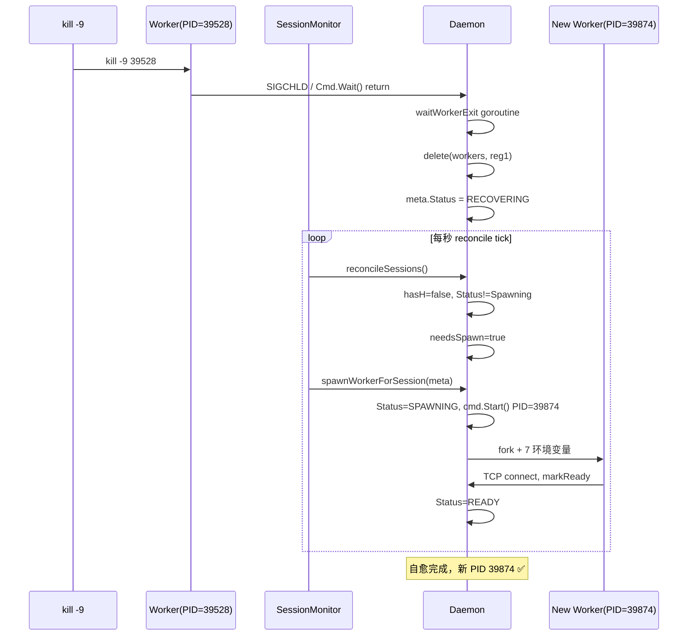
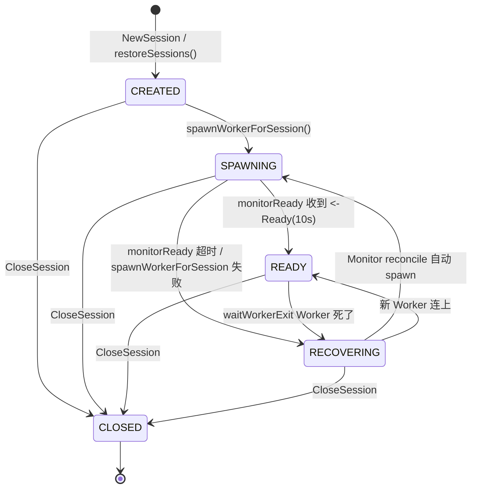
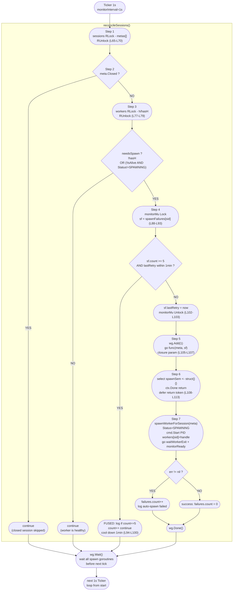

# botmux-go V3 技术设计文档 — Session↔Worker 解耦与自动自愈

> **版本**: V3
> **日期**: 2026-08-12
> **主题**: 结构体拆分、SessionMonitor 自愈巡检、CLI 管理命令
> **V2 文档**: [v2-architecture.md](v2-architecture.md)

---

## 一、V3 核心改动总览

### 1.1 三大交付（PR-A / PR-B / PR-C）

| PR | 代号 | 核心交付 | 代码量 |
|----|------|---------|--------|
| **PR-A** | 结构体拆分 | SessionMeta（持久化层）+ WorkerHandle（运行时层）双 map；spawnWorkerForSession 抽离为统一入口 | ~300 行（新增 + 重构） |
| **PR-B** | Monitor 自愈 | SessionMonitor 每秒 reconcileSessions；Worker 心跳 30s 超时自动拉起；5 层防风暴 | ~150 行（新增） |
| **PR-C** | CLI 管理 | 6 种新 MsgType + `list/history/close` 三子命令；ASCII 表格渲染；close 竞争防护 | ~180 行（修改） |

### 1.2 新增 / 修改文件清单

| 文件 | 操作 | 行数 | 说明 |
|------|------|------|------|
| `internal/daemon/session_meta.go` | **新增** | ~110 | SessionMeta 持久化层 + 5 状态常量 |
| `internal/daemon/worker_handle.go` | **新增** | ~80 | WorkerHandle 运行时层 + IsAlive/Send/markReady |
| `internal/daemon/session_monitor.go` | **新增** | ~110 | reconcileSessions 巡检 + 5 层风暴防护 |
| `internal/daemon/daemon.go` | **重写** | ~780 | 双 map + spawnWorkerForSession + 3 种管理 MsgType |
| `internal/protocol/protocol.go` | **修改** | +7 | 6 种 MsgType: ListSessions/Rsp, History/Rsp, CloseSession/Ack |
| `cmd/daemon/main.go` | **修改** | +163 | list/history/close 子命令 + usage 说明 |
| `internal/worker/worker.go` | **修改** | - | 15 处 `[:8]` → safeShortID() 防短 ID 越界 |

---

## 二、架构演进图

### 2.1 V2 架构（混元体问题）

```
┌──────────────────────────────────────────────┐
│  Daemon                                      │
│  └── WorkerSession (混元体)                  │
│      ├── SessionID / BotID / LastOutput      │ ← 持久化层（跨重启存活）
│      └── Cmd / Conn / Connected chan        │ ← 运行时层（重启必丢）
│                                              │
│  问题：一个 map 混合两种生命周期完全不同的数据  │
│  结果：Daemon 重启 → 僵尸 Session             │
│        Worker 被杀 → Session 一起被删 ❌     │
└──────────────────────────────────────────────┘
```

### 2.2 V3 架构（双 map 解耦）

```
┌──────────────────────────────────────────────────────────────────┐
│  Daemon                                                          │
│                                                                  │
│  ┌─────────────────────────┐    ┌─────────────────────────┐    │
│  │  sessions map           │    │  workers map            │    │
│  │  map[string]*SessionMeta│    │  map[string]*WorkerHandle│    │
│  │                         │    │                         │    │
│  │  持久化层                │    │  运行时层                │    │
│  │  - JSON 跨 Daemon 重启   │    │  - 仅内存，重启就没      │    │
│  │  - 6 状态状态机          │    │  - IsAlive 30s 心跳     │    │
│  │  - 50 行环形输出缓冲     │    │  - Ready chan 同步       │    │
│  │  - Close 竞争标记        │    │  - Cmd/Kill/Wait 控制   │    │
│  └────────────┬────────────┘    └──────────┬──────────────┘    │
│               │  session_id (1:1 外键)      │                   │
│               └──────────┬──────────────────┘                   │
│                          │                                       │
│               SessionMonitor (1s tick)                          │
│               ┌─────────────────────────────┐                  │
│               │  reconcileSessions()         │                  │
│               │  ① 快照 sessions             │                  │
│               │  ② 跳过 Closed               │                  │
│               │  ③ 查 workers + 判活         │                  │
│               │  ④ 失败冷却（5次/1min）       │                  │
│               │  ⑤ wg.Add goroutine          │                  │
│               │  ⑥ spawnSem 限并发 5          │                  │
│               │  ⑦ spawnWorkerForSession     │                  │
│               └─────────────────────────────┘                  │
└──────────────────────────────────────────────────────────────────┘
```

### 2.3 Worker 被杀自愈时序图



---

## 三、Session 状态机

### 3.1 5 状态定义

```go
// internal/daemon/session_meta.go
const (
    StatusCreated    SessionStatus = "CREATED"     // 新建或恢复，Worker 待启动
    StatusSpawning   SessionStatus = "SPAWNING"    // spawnWorkerForSession 执行中
    StatusReady      SessionStatus = "READY"       // Worker 已连接，可收发消息
    StatusRecovering SessionStatus = "RECOVERING"  // Worker 死了，Monitor 正在补
    StatusClosed     SessionStatus = "CLOSED"     // 真关闭，不再拉起
)
```

### 3.2 状态转换图



### 3.3 状态写入点（只有 4 个函数写状态）

| 函数 | 写入 | 代码位置 |
|------|------|---------|
| `CloseSession` | `Closed=true, Status=CLOSED` | daemon.go#L357-L358 |
| `spawnWorkerForSession` | `Status=SPAWNING` | daemon.go 内部 |
| `monitorReady` | `Status=READY` / `Status=RECOVERING`（超时）| daemon.go 内部 |
| `waitWorkerExit` | `Status=RECOVERING`（Closed=false 时）| daemon.go#L300 |

---

## 四、双 Map 数据结构

### 4.1 SessionMeta（持久化层，session_meta.go）

```go
type SessionMeta struct {
    SessionID  string
    BotID      string
    CliType    string
    CliPath    string
    WorkingDir string
    LastOutput []string     // 最近 50 行输出（ring buffer）
    CreatedAt  time.Time
    Closed     bool         // 竞争防护：真关闭标记
    Status     SessionStatus

    mu         sync.Mutex
    lastActive time.Time
    onClose    []func()
}
```

**核心方法**：
- `AddOutput(line)` — 追加输出，>50 行自动截断
- `SnapshotOutput()` — 深拷贝返回（防并发读写问题）
- `LastActive()` — 返回最近活跃时间
- `DrainOnClose()` — 取出 onClose 回调并置 nil（一次性）
- `ToPersisted()` / `SessionMetaFromPersisted(ps)` — JSON 序列化/反序列化

### 4.2 WorkerHandle（运行时层，worker_handle.go）

```go
type WorkerHandle struct {
    SessionID string
    Cmd       *exec.Cmd     // Worker 进程句柄
    Conn      net.Conn      // TCP 连接
    Ready     chan struct{} // Worker 就绪同步
    Pid       int           // Worker PID

    mu      sync.Mutex
    hbSeen  time.Time       // 最近心跳时间
    isReady bool            // markReady 幂等保护
    closed  bool            // CloseConn 标记
}
```

**核心方法**：
- `IsAlive()` — `hbSeen` 距现在 < 30s 且 `!closed` 且 `Conn != nil`
- `TouchHb()` — 更新心跳时间
- `Send(msg)` — 往 TCP 连接写消息
- `markReady()` — 幂等地 close(Ready chan)
- `CloseConn()` — 关闭连接

### 4.3 Daemon 双 Map 关系

```
Daemon struct {
    sessionsMu sync.RWMutex
    sessions   map[string]*SessionMeta    // 持久化层

    workersMu sync.RWMutex
    workers   map[string]*WorkerHandle    // 运行时层

    monitorMu     sync.Mutex
    monitorStop   chan struct{}
    spawnFailures map[string]*spawnFailure // 单 session 失败计数
    spawnSem      chan struct{}            // 并发信号量（容量 5）
}
```

**1:1 关联**：两个 map 通过 `sessionID` 作为主键关联，查询时双 map 分别读（sessions 读 meta 字段，workers 读 PID/心跳）。

---

## 五、SessionMonitor reconcile 机制

### 5.1 5 层风暴防护常量

```go
const (
    monitorInterval     = 1 * time.Second   // 巡检间隔
    workerAliveTimeout  = 30 * time.Second  // 心跳超时阈值
    maxSpawnRetries     = 5                 // 单 session 失败上限
    monitorStartDelay   = 3 * time.Second   // 启动延迟（防重启风暴）
    maxConcurrentSpawns = 5                 // 并发 spawn 上限
)
```

### 5.2 reconcileSessions 7 步流水线

#### Step 1：sessions 快照（L65-L70）
```go
d.sessionsMu.RLock()
metas := make([]*SessionMeta, 0, len(d.sessions))
for _, m := range d.sessions { metas = append(metas, m) }
d.sessionsMu.RUnlock()
```
**作用**：快照模式缩短写锁持有时间，避免阻塞 NewSession/CloseSession。

#### Step 2：跳过 Closed（L74-L76）
```go
if meta.Closed { continue }
```
**作用**：终态不再 spawn，和状态机 CLOSED 态配合。

#### Step 3：查 workers + 判活（L77-L86）
```go
d.workersMu.RLock()
h, hasH := d.workers[meta.SessionID]
d.workersMu.RUnlock()

needsSpawn := false
if !hasH {
    needsSpawn = true
} else if !h.IsAlive() && meta.Status != StatusSpawning {
    needsSpawn = true
}
```
**关键防护**：`Status != StatusSpawning` — spawn 进行中的 session 本轮跳过，防止双 Worker 乒乓。

#### Step 4：失败冷却（L87-L103）
```go
sf, ok := d.spawnFailures[meta.SessionID]
if !ok { sf = &spawnFailure{}; d.spawnFailures[meta.SessionID] = sf }

if sf.count >= maxSpawnRetries && time.Since(sf.lastRetry) < 1*time.Minute {
    // 熔断：5 次失败 + 1 分钟内 → 跳过
    if sf.count == maxSpawnRetries { log.Printf("... retries exhausted"); sf.count++ }
    continue
}
sf.lastRetry = time.Now()
```
**设计**：`count` 达 5 后 log 一次（不刷屏），+1 后 `>=5` 仍成立，直到 1 分钟冷却到期。

#### Step 5：wg.Add + 异步 goroutine（L105-L107）
```go
wg.Add(1)
go func(m *SessionMeta, failures *spawnFailure) {
    defer wg.Done()
    // Steps 6-7
}(meta, sf)
```
**关键**：参数传闭包防止 `for range` 循环变量捕获陷阱。

#### Step 6：spawnSem 并发信号量（L108-L113）
```go
select {
case d.spawnSem <- struct{}{}:   // 拿到令牌
case <-d.ctx.Done(): return       // Stop 时提前退出
}
defer func() { <-d.spawnSem }()
```
**设计**：`select` 而非普通写入，保证 Stop 时不会阻塞。

#### Step 7：spawnWorkerForSession + 计数更新（L115-L126）
```go
err := d.spawnWorkerForSession(m)
if err != nil {
    failures.count++                        // 失败：累加
} else {
    failures.count = 0                      // 成功：清零
}
```
**关键**：成功必须清零——之前的失败是历史，新的 Worker 证明系统恢复了健康。

### 5.3 reconcile 流程图



### 5.4 5 层风暴防护汇总

| 层 | 机制 | 代码行 | 没有它会发生什么？ |
|---|---|---|---|
| 1 | 启动延迟 3s | session_monitor.go#L36 | restoreSessions 刚塞完就全量 spawn → 启动瞬间 CPU 拉满 |
| 2 | spawnSem 并限 5 | L109 | 1000 个 session 同时 fork → 系统 load 飙升 / OOM |
| 3 | 单 session 熔断 5 次 + 1min cool down | L94 | 坏配置的 session 每秒 spawn 一次 → 持续 fork 开销 + 刷屏 |
| 4 | SPAWNING 跳过 | L84 | Worker 已 Start 但未连 → 双 Worker 乒乓 |
| 5 | wg.Wait() 等本轮 spawn 完成 | L130 | 下一轮 tick 时状态未写回 → 重复 spawn |

---

## 六、关键实现解析

### 6.1 spawnWorkerForSession — 统一 Fork 入口

```go
// daemon.go
func (d *Daemon) spawnWorkerForSession(meta *SessionMeta) error {
    handle := NewWorkerHandle(meta.SessionID)
    
    // 7 个环境变量把身份传给 Worker
    cmd := exec.CommandContext(d.ctx, d.selfExe)
    cmd.Env = append(os.Environ(),
        "BOTMUX_ROLE=worker",
        "BOTMUX_SESSION_ID="+meta.SessionID,
        "BOTMUX_CLI_TYPE="+meta.CliType,
        "BOTMUX_CLI_PATH="+meta.CliPath,
        "BOTMUX_WORKING_DIR="+meta.WorkingDir,
        "BOTMUX_STORE_DIR="+d.cfg.SessionsDir,
        "BOTMUX_DAEMON_ADDR="+d.cfg.ListenAddr,
    )
    cmd.Stdout = os.Stdout
    cmd.Stderr = os.Stderr
    handle.Cmd = cmd
    
    meta.Status = StatusSpawning
    if err := cmd.Start(); err != nil {
        meta.Status = StatusRecovering
        return fmt.Errorf("exec.Command Start: %w", err)
    }
    
    handle.Pid = cmd.Process.Pid
    d.workersMu.Lock()
    d.workers[meta.SessionID] = handle
    d.workersMu.Unlock()
    d.store.UpdateWorkerPID(meta.SessionID, handle.Pid)
    
    go d.waitWorkerExit(handle)
    go d.monitorReady(handle, meta)
    return nil
}
```

**被 3 条路径调用**：
1. `NewSession` → 创建新 session 时
2. `reconcileSessions` → Monitor 检测到 needsSpawn
3. `restoreSessions` → Daemon 重启后补 Worker

### 6.2 waitWorkerExit — Worker 清理但不删 Session

```go
func (d *Daemon) waitWorkerExit(handle *WorkerHandle) {
    err := handle.Cmd.Wait()
    
    d.workersMu.Lock()
    if h, ok := d.workers[handle.SessionID]; ok && h == handle {
        delete(d.workers, handle.SessionID)
    }
    d.workersMu.Unlock()
    
    // 关键：Closed=false 才设 RECOVERING
    d.sessionsMu.Lock()
    meta, ok := d.sessions[handle.SessionID]
    if ok && !meta.Closed {
        meta.Status = StatusRecovering
    }
    d.sessionsMu.Unlock()
    
    handle.CloseConn()
    for _, fn := range meta.DrainOnClose() {
        go fn()
    }
}
```

**核心设计**：Worker 死了**不删 sessions map**，只删 workers map。SessionMeta 还在，Status=RECOVERING，下一秒 reconcile 会看到并自动补新 Worker。

### 6.3 CloseSession — 竞争防护 3 步

```go
func (d *Daemon) CloseSession(id, reason string) {
    // 步骤 1: 先锁 sessions 写标记（竞争防护关键）
    d.sessionsMu.Lock()
    meta, ok := d.sessions[id]
    if !ok { d.sessionsMu.Unlock(); return }
    meta.Closed = true
    meta.Status = StatusClosed
    d.sessionsMu.Unlock()

    // 步骤 2: 发 MsgClose 给 Worker + 2s Kill 超时
    d.workersMu.RLock()
    h := d.workers[id]
    d.workersMu.RUnlock()
    if h != nil {
        h.Send(protocol.NewMessage(protocol.MsgClose, id, reason))
        timeout := time.AfterFunc(2*time.Second, func() {
            if h.Cmd != nil && h.Cmd.Process != nil {
                h.Cmd.Process.Kill()
            }
        })
        defer timeout.Stop()
        if h.Cmd != nil && h.Cmd.Process != nil {
            h.Cmd.Wait()
        }
    }

    // 步骤 3: removeSession（只标记不删除）
    d.removeSession(id)
}
```

**竞争防护要点**：
- 第 1 步原子写 `Closed=true`：`waitWorkerExit` 里 `if ok && !meta.Closed` 不命中 → 不设 RECOVERING
- 第 1 步原子写 `Closed=true`：`reconcileSessions` 里 `if meta.Closed {continue}` → 不 spawn
- 第 2 步先 Ack 后异步关：CLI 立即得到反馈，不等 Worker 退出

### 6.4 handleCloseSession — 先 Ack 后异步

```go
func (d *Daemon) handleCloseSession(conn net.Conn, sessionID, reason string) {
    _, _ = protocol.NewMessage(protocol.MsgCloseSessionAck, sessionID, "ok").WriteTo(conn)
    go d.CloseSession(sessionID, reason)
}
```

**设计权衡**：Ack 立即返回（CLI 不卡），CloseSession 后台执行（最长 2s Kill 超时 + Cmd.Wait）。

### 6.5 handleListSessions — 双 Map 聚合

```go
func (d *Daemon) handleListSessions(conn net.Conn) {
    d.sessionsMu.RLock()
    metas := make([]*SessionMeta, 0, len(d.sessions))
    for _, m := range d.sessions { metas = append(metas, m) }
    d.sessionsMu.RUnlock()
    
    var entries []sessionListEntry
    for _, m := range metas {
        pid := 0
        d.workersMu.RLock()
        if h, ok := d.workers[m.SessionID]; ok { pid = h.Pid }
        d.workersMu.RUnlock()
        entries = append(entries, sessionListEntry{
            SessionID:  m.SessionID,
            BotID:      m.BotID,
            CliType:    m.CliType,
            Status:     string(m.Status),
            Pid:        pid,
            LastActive: m.LastActive().Format("15:04:05"),
            Outputs:    m.SnapshotOutput(),
        })
    }
    // 序列化为 JSON 写回
}
```

### 6.6 SendInput — Closed 快速报错

```go
func (d *Daemon) SendInput(id, input string) error {
    d.sessionsMu.RLock()
    meta, ok := d.sessions[id]
    d.sessionsMu.RUnlock()
    if !ok { return fmt.Errorf("session %s not found", id) }
    if meta.Closed { return fmt.Errorf("session %s is closed", id) }  // ← Case 6 核心
    // ...
}
```

### 6.7 Worker safeShortID 修复

```go
// internal/worker/worker.go
func safeShortID(s string) string {
    if len(s) <= 8 { return s }
    return s[:8]
}
```

**修复原因**：V2 Worker 15 处 `w.sessionID[:8]`，当 sessionID=`"demo"`（4 字符）会 `panic: slice bounds out of range [:8] with length 4`。

---

## 七、协议扩展

### 7.1 新增 6 种 MsgType

```go
// internal/protocol/protocol.go
const (
    MsgListSessions    MessageType = "list_sessions"
    MsgListSessionsRsp MessageType = "list_sessions_rsp"
    MsgHistory         MessageType = "history"
    MsgHistoryRsp      MessageType = "history_rsp"
    MsgCloseSession    MessageType = "close_session"
    MsgCloseSessionAck MessageType = "close_session_ack"
)
```

### 7.2 新增 CLI 子命令

| 子命令 | 别名 | 对应 MsgType | 说明 |
|--------|------|-------------|------|
| `list` | `ls`, `sessions` | MsgListSessions | 列出所有 session，7 列 ASCII 表格 |
| `history` | `hs` | MsgHistory | 查看指定 session 历史输出，带行号索引 |
| `close` | `rm`, `delete` | MsgCloseSession | 关闭 session（payload = reason） |

### 7.3 list 表格字段

```
SESSION_ID               BOT                CLI        STATUS       PID      LAST_ACTIVE            LAST_OUTPUT
s1                       bot-mock           mock       READY        49123    2026-08-11 15:04:11    [mock-echo] hello case1 v3
s2                       bot-mock           mock       CLOSED       -        2026-08-11 15:04:45    [mock-echo] test
```

### 7.4 history 输出格式

```
  [1] [mock-echo] hello case1 v3
  [2] [mock-echo] second msg
  [3] [mock-echo] third msg
[cli] 3 line(s)
```

**行号对齐**：当条数 ≥ 10 时，`[1]` 会显示为 `[ 1]`（前补空格），与 `[10]` 宽度对齐。

---

## 八、V3 测试 SOP

### 8.1 环境准备

```bash
# 编译
cd /Users/bytedance/botmux-go
go build -o /tmp/botmux-go ./cmd/daemon

# 清理 + 启动
pkill -9 -f botmux-go 2>/dev/null
rm -rf /tmp/botmux-sessions
mkdir -p /tmp/botmux-sessions
export BOTMUX_SESSIONS_DIR=/tmp/botmux-sessions
BINARY=/tmp/botmux-go
CONFIG=/Users/bytedance/botmux-go/configs/bots.json

$BINARY -config $CONFIG > /tmp/botmux-daemon.log 2>&1 &
sleep 5

# 验证启动
head -12 /tmp/botmux-daemon.log
# ✅ 预期: bots=2, mock-bot + codex-bot 都出现
```

### 8.2 Case 1：新建 + 收发消息

```bash
$BINARY -cmd new s1 bot-mock
# ✅ 预期: session s1 READY

$BINARY -cmd send s1 "hello case1 v3"
# ✅ 预期: << [mock-echo] hello case1 v3
```

### 8.3 Case 2：list 表格

```bash
$BINARY -cmd list
# ✅ 预期: 7 列表头 + s1 行 (BOT=bot-mock, STATUS=READY, PID≠0)
```

### 8.4 Case 3：history 行号

```bash
$BINARY -cmd send s1 "second msg" >/dev/null 2>&1
$BINARY -cmd send s1 "third msg"  >/dev/null 2>&1
sleep 1

$BINARY -cmd history s1
# ✅ 预期: [1]... [2]... [3]... + "3 line(s)"
```

### 8.5 Case 4：Worker 被杀自愈

```bash
OLD_PID=$(python3 -c "import json; print(json.load(open('/tmp/botmux-sessions/s1.json'))['worker_pid'])")
kill -9 $OLD_PID
sleep 6

NEW_PID=$(python3 -c "import json; print(json.load(open('/tmp/botmux-sessions/s1.json'))['worker_pid'])")
[ "$OLD_PID" != "$NEW_PID" ] && echo "✅ PID changed!" || echo "❌ SAME PID!"

$BINARY -cmd send s1 "i am alive after kill -9"
# ✅ 预期: << [mock-echo] i am alive after kill -9
```

### 8.6 Case 5：Daemon 重启恢复

```bash
BEFORE_LINES=$($BINARY -cmd history s1 2>&1 | grep -c "\[.*\]")

pkill -9 -f botmux-go
sleep 3

$BINARY -config $CONFIG > /tmp/botmux-daemon.log 2>&1 &
sleep 10

$BINARY -cmd list
# ✅ 预期: s1 STATUS=READY, PID≠0

AFTER_LINES=$($BINARY -cmd history s1 2>&1 | grep -c "\[.*\]")
[ "$AFTER_LINES" -ge "$BEFORE_LINES" ] && echo "✅ history preserved!" || echo "❌ history LOST!"

$BINARY -cmd send s1 "hi after daemon restart"
# ✅ 预期: << [mock-echo] hi after daemon restart
```

### 8.7 Case 6：close 真关闭

```bash
$BINARY -cmd new s2 bot-mock >/dev/null 2>&1
sleep 2

$BINARY -cmd close s2 "case6-test-reason"
# ✅ 预期: session s2 closed (reason="case6-test-reason")

sleep 5  # 等异步 CloseSession 完成

$BINARY -cmd send s2 "this MUST fail"
# ✅ 预期: !! error: session s2 is closed

sleep 10  # 确认 Monitor 不会重新拉起

$BINARY -cmd list | grep s2
# ✅ 预期: s2 CLOSED - (PID 是 -，不是新 PID)

python3 -c "import json; d=json.load(open('/tmp/botmux-sessions/s2.json')); print('closed =', d['closed'])"
# ✅ 预期: closed = True
```

### 8.8 测试验收 Checklist

- [ ] **Case 1**：new → READY + send → mock-echo 回显
- [ ] **Case 2**：list 7 列完整，BOT=bot-mock STATUS=READY PID≠0
- [ ] **Case 3**：history 3 行 + 行号索引 + `3 line(s)`
- [ ] **Case 4**：kill -9 Worker → OLD_PID ≠ NEW_PID + send 继续 echo
- [ ] **Case 5**：Daemon 重启 → READY + history 条数不减 + 新 send 成功
- [ ] **Case 6**：close 立即 ack + send 报 `is closed` + 10s 后仍 CLOSED + JSON closed=True

### 8.9 调试速查表

| 问题 | 去哪查 | 关键字 |
|------|--------|--------|
| 任何问题 | `tail -50 /tmp/botmux-daemon.log` | `[daemon-monitor]` / `[worker:XXX]` / `spawn retries exhausted` / `panic` |
| Monitor 有没有调 reconcile | `grep monitor /tmp/botmux-daemon.log` | `auto-spawn` / `started` |
| 持久化 JSON 对不对 | `cat /tmp/botmux-sessions/s1.json \| python3 -m json.tool` | `worker_pid` / `last_output` / `closed` / `status` |
| Worker 进程在不在 | `ps -ef \| grep "botmux-go" \| grep -v grep` | Worker 进程 env 有 `BOTMUX_ROLE=worker` |
| TCP 连接状态 | `lsof -iTCP:17890 -sTCP:ESTABLISHED` | ESTABLISHED 数 = 监听 + READY session 数 |

---

## 九、V3 实现里程碑

| 里程碑 | PR | 日期 | 交付物 | git commit |
|--------|-----|------|--------|-----------|
| **M1：结构体拆分** | PR-A | 2026-08-11 | session_meta.go + worker_handle.go + daemon.go 双 map 重构 | `a5aa1d9` feat(v3-pr-a) |
| **M2：Monitor 自愈** | PR-B | 2026-08-11 | session_monitor.go reconcileSessions + 5 层防护 | `9038a59` feat(v3-pr-b) |
| **M3：CLI 管理命令** | PR-C | 2026-08-11 | 6 MsgType + list/history/close 子命令 + worker.go safeShortID | 待提交 feat(v3-pr-c) |
| **M4：Case 1-6 全回归** | — | 2026-08-12 | 6 Case 全通过 + 竞争防护验证 | 待提交 feat(v3) |
| **M5：文档整理** | — | 2026-08-12 | 本文档 + docs/README.md 更新 | — |

### 代码量统计

| 文件 | 操作 | 行数 |
|------|------|------|
| session_meta.go | 新增 | ~110 |
| worker_handle.go | 新增 | ~80 |
| session_monitor.go | 新增 | ~110 |
| daemon.go | 重写 | ~780 |
| protocol.go | 修改 | +7 |
| main.go | 修改 | +163 |
| worker.go | 修改 | - |
| **合计** | | **~1250 行** |

---

## 十、V3 → V4 演进方向

| 优先级 | 任务 | 说明 |
|--------|------|------|
| 🔴 P0 | HTTP Dashboard | `GET /api/sessions` REST API + 会话详情页 |
| 🟡 P1 | CodexAdapter 实现 | 真实 codex CLI 启动/交互 |
| 🟡 P1 | tmux auto-create | `TmuxAdapter.Start()` 自动 `tmux new-session` |
| 🟡 P1 | 会话级目录 | `sessions_dir/<sid>/` 独立存储 transcript/workspace |
| 🟢 P2 | WebSocket 实时推送 | MsgOutput 流式推送到 Web UI |
| 🟢 P2 | STALE 状态 | 5 次重试失败后进入 STALE，等用户手动 close |

---

## 十一、学习心得

### 11.1 从混元体到双 map 的解耦模式

V2 的 `WorkerSession` 把持久化和运行时塞一张表，V3 拆成 `SessionMeta`（持久化表）+ `WorkerHandle`（运行时表），用 `sessionID` 做 1:1 外键。这是关系型数据库范式在内存数据结构中的体现：

- 持久化表：生命周期 = Daemon 进程生命周期（跨重启存活）
- 运行时表：生命周期 = Worker 进程生命周期（Worker 死就删，由 Monitor 重建）

### 11.2 reconcile 模式作为自愈核心

借鉴 Kubernetes Controller 的 reconcile 模式：**定期对比期望状态 vs 实际状态，补齐差异**。不做事件驱动（Worker 死了通知 Daemon），而是做轮询驱动（每秒巡检），好处是：
- 简单：不需要 Worker → Daemon 的通知机制
- 可靠：即使 Worker 死时没来得及通知，下一轮 tick 也能发现
- 可扩展：未来加新 session 类型只改 reconcile 逻辑

### 11.3 竞争防护的 3 层写法

CloseSession 是 V3 竞争的核心，用了「先写锁 + 标记 + 后释放」模式：
1. 先拿 sessions 写锁，写 `Closed=true`
2. 释放锁，做耗时操作（Kill + Wait）
3. 竞争双方（waitWorkerExit / reconcile）读到 `Closed=true` 后都跳过

这比「先读再写」更安全——经典 TOCTOU 问题的根治方案。

### 11.4 风暴防护的工程经验

5 层防护不是冗余，是每一层解决一种具体的雪崩场景：
- 启动延迟 3s → 防 Daemon 重启风暴
- 信号量 5 → 防大量 session 同时 spawn
- 单 session 熔断 → 防坏配置死循环
- SPAWNING 跳过 → 防双 Worker 乒乓
- wg.Wait → 防状态读写竞争
