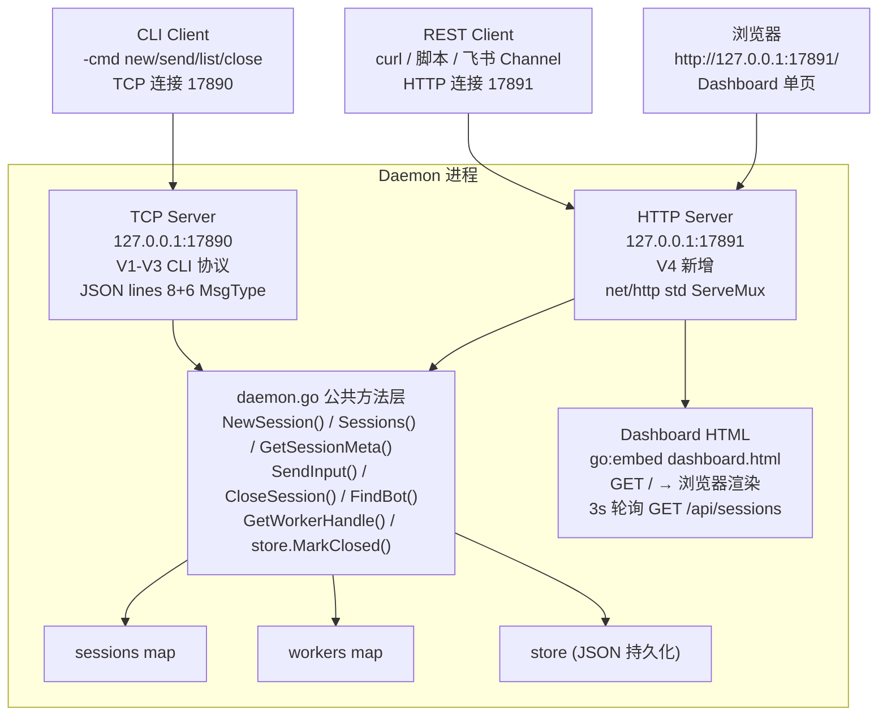

# botmux-go V4 技术设计文档 — HTTP Dashboard + REST API

> **版本**: V4（方案阶段）
> **日期**: 2026-08-13
> **主题**: HTTP Server 嵌入 + REST API + 纯静态 Dashboard 单页
> **V3 文档**: [v3-architecture.md](v3-architecture.md)

---

## 一、V4 目标与边界

### 1.1 为什么做 V4

TS 原版 `src/dashboard` 在 2026 年 4-6 月内产生了 **159 次 commit**，是整个项目 TOP 4 大模块，仅次于 `src/core` / `src/adapters` / `src/im`。官方把 Dashboard 当成产品主入口来建设——从简单的会话列表页逐步扩展成 10+ 页面的管理后台，覆盖会话管理、工作流、Bot 配置、团队联邦、Webhook、角色权限等。

我们 Go 版 V1-V3 已完成核心调度（Daemon + Worker + Monitor 自愈 + CLI 管理命令），下一步自然是把 CLI 的能力搬成 HTTP API + 可视化面板，方便日常使用和后续 V5/V6 的集成（飞书 Channel 需要 REST API 回调）。

### 1.2 对标官方迭代阶段

| 阶段 | 时间 | commit 数 | 核心交付 | 我们 V4 对齐 |
|------|------|----------|---------|-------------|
| **Stage 1：基础版** | 2026-04-30 | 5 次（1 天）| 会话列表页 + 群组页 + 定时任务页 + Aggregator + Registry + Auth | **对齐会话列表页（简化）**，跳过多 Daemon 聚合/SSE/Auth |
| **Stage 2：扩展版** | 2026-05 中 | 10+ 次 | 总览页 + 工作流页 + Bot 接入向导 + Bot 默认设置 + 团队联邦 + 角色 + Webhook 路由 + 连接器 | **不做**，等有真实业务场景 |
| **Stage 3：高级版** | 2026-06 | 100+ 次 | i18n 国际化 + 7 套主题皮肤 + 终端卡片 HMAC 门控 + 文件沙盒 + Session Discovery + Public Read-Only + Agent Attention Strip | **只对齐 Session Discovery**（`?bot_id/status/sort` 查询参数），其余全部跳过 |

### 1.3 目标

1. 给 botmux-go Daemon 加一个**内嵌 HTTP 层**（`net/http` 标准库，0 第三方依赖），默认监听 `127.0.0.1:17891`，与 TCP CLI `127.0.0.1:17890` 双端口并存
2. 提供一套 REST API（healthz / sessions GET+POST+DELETE / send / history download / bots），未来飞书 Channel、Shell 脚本、第三方工具都能直接调
3. 内嵌一个**纯静态 Dashboard 单页**（HTML + 原生 JS fetch，0 npm 构建），支持会话列表轮询 / 详情弹窗 + 发送消息 / 关闭会话 / 下载历史
4. 对齐官方 Dashboard 的 Session Discovery 能力：`GET /api/sessions` 支持 `?bot_id=&status=&sort=&limit=&offset=` 查询参数

### 1.4 非目标（留给 V5/V6）

- 不做 Auth / HMAC 门控 / Token 认证（默认 127.0.0.1 安全）
- 不做多 Daemon 聚合 / SSE 实时推送 / Registry（单 Daemon 架构）
- 不做 i18n / 主题皮肤 / hero 切换（先用一套默认中文字体+配色）
- 不做工作流 / Bot 接入向导 / 群组 / 角色 / Webhook / 定时任务 / 文件沙盒
- 不做 tmux 终端卡片 / 自动更新 / Agent Attention Strip

---

## 二、架构设计

### 2.1 双端口并存架构图



**关键设计**：REST handler 不写业务逻辑，全部转调 `daemon.go` 已有的 5 个公共方法（[daemon.go#L125-L428](file:///Users/bytedance/botmux-go/internal/daemon/daemon.go#L125-L428)）。

### 2.2 数据流向

```
浏览器 Dashboard
    │
    │ 3s 轮询 GET /api/sessions?sort=last_active,desc
    ▼
HTTP Handler (http_server.go)
    │
    │ 调 d.Sessions() + d.GetWorkerHandle()
    ▼
Daemon 公共方法层 (daemon.go)
    │
    │ 读 sessions map (RLock) + workers map (RLock)
    ▼
返回 JSON → Handler 写响应 → 浏览器渲染会话表格
```

```
浏览器发送消息
    │
    │ POST /api/sessions/:sid/send
    │ body: {input: "hello", wait_output_ms: 8000}
    ▼
HTTP Handler
    │
    │ 调 d.SendInput(sid, input)
    │   ├─ sessions RLock → meta.Closed 检查
    │   ├─ workers RLock → h.Ready 等待
    │   └─ h.Send(MsgUserInput) → Worker echo
    │  + 轮询 meta.SnapshotOutput() 等输出
    ▼
返回 {ok, outputs} → 浏览器 append 到 history
```

---

## 三、配置与结构体扩展

### 3.1 config.DaemonConfig 新增字段

[config.go](file:///Users/bytedance/botmux-go/internal/config/config.go#L36-L41) 新增 `DashboardAddr`：

```go
type DaemonConfig struct {
    ListenAddr    string `json:"listen_addr"`     // 原有，TCP CLI 默认 17890
    DashboardAddr string `json:"dashboard_addr"`  // 【V4 新增】HTTP Dashboard，默认 "127.0.0.1:17891"
    LogLevel      string `json:"log_level"`
    SessionsDir   string `json:"sessions_dir"`
    Bots          []BotConfig `json:"bots"`
}
```

`DefaultConfig()` 补默认值：
```go
DashboardAddr: "127.0.0.1:17891",
```

`cmd/daemon/main.go` 新增启动 flag：
```go
flag.StringVar(&dashboardAddr, "dashboard", "", "override dashboard listen addr (default 127.0.0.1:17891)")
```

### 3.2 Daemon struct 新增字段

[daemon.go#L20-L47](file:///Users/bytedance/botmux-go/internal/daemon/daemon.go#L20-L47) 新增 `httpListener`：

```go
type Daemon struct {
    cfg          *config.DaemonConfig
    listener     net.Listener   // 原有 TCP CLI listener (17890)
    httpListener net.Listener   // 【V4 新增】HTTP Dashboard listener (17891)
    selfExe      string
    store        *SessionStore
    // ... 其他字段不变
}
```

### 3.3 Start() / Stop() 扩展

```go
func (d *Daemon) Start() error {
    // ... 原有 restoreSessions + startSessionMonitor + acceptLoop ...
    d.wg.Add(1)
    go d.startHTTPServer()  // 【V4 新增】并行启动 HTTP Server
    return nil
}

func (d *Daemon) Stop() error {
    // ... 原有 stopSessionMonitor + cancel ...
    if d.httpListener != nil {
        _ = d.httpListener.Close()  // 【V4 新增】关闭 HTTP listener
    }
    // ... 原有 listener.Close + CloseSession ...
}
```

---

## 四、3 PR 拆分（V4 里程碑）

| PR | 代号 | 新增/修改文件 | 交付 | 冒烟 Case | 代码量 |
|----|------|---------------|------|----------|--------|
| **PR-A** | HTTP 服务器架子 | 新：`internal/daemon/http_server.go`<br/>改：`daemon.go`（Start/Stop 启 HTTP）/`config.go`（DashboardAddr）/`main.go`（-dashboard flag） | `go build` + healthz 接口 | A1: build 通过<br/>A2: `curl healthz` 返回 ok=true<br/>A3: Stop 后 listener 正常关 | ~130 行 |
| **PR-B** | 完整 REST API | 改：`http_server.go`（全部 handler） | 7 个 curl Case | B1: sessions 列表 + 查询参数<br/>B2: 单会话详情<br/>B3: 新建 + 发送 + 关闭<br/>B4: history txt 下载<br/>B5: 错误码正确（CLOSED/NOT_FOUND）<br/>B6: 关闭后 Monitor 不拉起<br/>B7: bots 列表 | ~330 行 |
| **PR-C** | Dashboard 单页 | 新：`internal/daemon/embed_dashboard.go`<br/>新：`internal/daemon/dashboard.html`<br/>改：`http_server.go`（路由注册） | 浏览器 4 Case | C1: 页面加载 + 3s 轮询<br/>C2: 点击会话 → 弹窗详情<br/>C3: 发送消息 → history 更新<br/>C4: 关闭会话 → 状态变 CLOSED<br/>C5: 下载历史 txt | ~370 行 |

**合计 ~830 行（Go 纯标准库 0 第三方依赖）**

---

## 五、REST API 规格

### 5.1 通用规范

- **前缀**：`http://127.0.0.1:17891`
- **Content-Type**：所有响应 `application/json`（除下载接口）
- **错误响应**：`{"error": "<msg>", "code": "<ERR_CODE>"}`，HTTP 状态码非 2xx
- **分页**：`GET /api/sessions` 支持 `?limit=&offset=`，默认 limit=100，上限 500

### 5.2 错误码表

| code | HTTP | 场景 |
|------|------|------|
| OK | 200/201 | 成功 |
| NOT_FOUND | 404 | session / bot 不存在 |
| BAD_REQUEST | 400 | JSON 解析失败 / 必填字段缺 |
| SESSION_CLOSED | 400 | 对 closed session send |
| NO_WORKER | 409 | session CREATED/RECOVERING 但 Worker 未 ready |
| WORKER_NOT_READY | 503 | Worker 存在但 <-Ready 等待超时 |
| OUTPUT_TIMEOUT | 504 | wait_output 超过时间 |
| INTERNAL_ERROR | 500 | daemon 层返回非自定义 error |

### 5.3 健康检查

```
GET /api/healthz
```

**200**
```json
{
  "ok": true,
  "listen": "127.0.0.1:17890",
  "dashboard": "127.0.0.1:17891",
  "started_at": "2026-08-13T10:23:45+08:00",
  "sessions_count": 2,
  "workers_count": 1,
  "bots_count": 2,
  "version": "v3"
}
```

### 5.4 查询会话列表

```
GET /api/sessions
    ?bot_id=bot-mock          【可选】按 bot_id 过滤
    &status=READY             【可选】CREATED/SPAWNING/READY/RECOVERING/CLOSED
    &closed=false             【可选】默认 false，true 包含 closed 历史
    &sort=last_active,desc    【可选】格式 <field>,<asc|desc>
    &limit=100                【可选】默认 100，上限 500
    &offset=0                 【可选】分页偏移
```

**200**
```json
{
  "total": 2,
  "items": [
    {
      "session_id": "s1",
      "bot_id": "bot-mock",
      "cli_type": "mock",
      "working_dir": "~",
      "status": "READY",
      "closed": false,
      "pid": 49123,
      "alive": true,
      "created_at": "2026-08-13T10:20:00+08:00",
      "last_active": "2026-08-13T10:26:45+08:00",
      "last_output": {
        "count": 3,
        "tail": ["[mock-echo] hello", "[mock-echo] hi", "[mock-echo] bye"],
        "tail_limit": 3
      }
    }
  ]
}
```

### 5.5 查询单个会话详情

```
GET /api/sessions/:sid
    ?history_lines=50   【可选】默认 50，上限 500
```

**200**
```json
{
  "session_id": "s1",
  "bot_id": "bot-mock",
  "cli_type": "mock",
  "backend_type": "pty",
  "working_dir": "~",
  "status": "READY",
  "closed": false,
  "pid": 49123,
  "alive": true,
  "last_heartbeat_secs_ago": 2,
  "created_at": "2026-08-13T10:20:00+08:00",
  "last_active": "2026-08-13T10:26:45+08:00",
  "persisted_path": "/tmp/botmux-sessions/s1.json",
  "history": [
    {"i": 1, "line": "[mock-echo] hello", "ts": "2026-08-13T10:21:03+08:00"},
    {"i": 2, "line": "[mock-echo] hi"},
    {"i": 3, "line": "[mock-echo] bye"}
  ],
  "history_count": 3,
  "bot_config": {
    "name": "mock-bot",
    "bot_id": "bot-mock",
    "cli_type": "mock",
    "backend_type": "pty",
    "allowed_users": []
  }
}
```

**404**
```json
{"error": "session s99 not found", "code": "NOT_FOUND"}
```

### 5.6 历史输出下载

```
GET /api/sessions/:sid/history
    ?format=json             【默认】同 5.5 的 history 字段
    ?format=txt              纯文本下载，Content-Disposition: attachment
    ?format=lines            紧凑字符串数组（方便 jq）
    ?limit=500               【默认 500，上限 5000】
```

**txt 格式响应**（Content-Type: text/plain）
```
# botmux-go session history
session_id: s1
bot_id    : bot-mock
created   : 2026-08-13T10:20:00+08:00
exported  : 2026-08-13T10:28:02+08:00
total_lines: 3
------------------------------------
  [1] [mock-echo] hello
  [2] [mock-echo] hi
  [3] [mock-echo] bye
```

### 5.7 新建会话

```
POST /api/sessions
Content-Type: application/json

{
  "session_id": "my-session",
  "bot_id": "bot-mock",
  "working_dir": "~",
  "auto_start_worker": true
}
```

**201 Created**
```json
{
  "session_id": "my-session",
  "status": "READY",
  "pid": 50011,
  "bot_id": "bot-mock",
  "cli_type": "mock",
  "created_at": "2026-08-13T10:29:00+08:00"
}
```

### 5.8 发送消息

```
POST /api/sessions/:sid/send
Content-Type: application/json

{
  "input": "what is 2+2",
  "wait_output_ms": 8000,
  "output_limit_lines": 10
}
```

**200**
```json
{
  "ok": true,
  "sent_at": "2026-08-13T10:30:00+08:00",
  "outputs_received": 1,
  "outputs": [
    {"ts": "2026-08-13T10:30:00+08:00", "line": "[mock-echo] what is 2+2"}
  ]
}
```

**错误响应**
```json
{"error": "session s1 is closed", "code": "SESSION_CLOSED"}
{"error": "session s1 has no worker (status=RECOVERING)", "code": "NO_WORKER"}
{"error": "timeout waiting first output after 8s", "code": "OUTPUT_TIMEOUT"}
```

### 5.9 关闭会话

```
DELETE /api/sessions/:sid
    ?reason=user-close-from-dashboard
```

**200**
```json
{
  "ok": true,
  "session_id": "s1",
  "status": "CLOSED",
  "reason": "user-close-from-dashboard",
  "closed_at": "2026-08-13T10:30:00+08:00",
  "note": "async cleanup in progress, worker will be gone within ~2 seconds"
}
```

### 5.10 Bot 列表

```
GET /api/bots
```

**200**
```json
{
  "items": [
    {"name":"mock-bot","bot_id":"bot-mock","cli_type":"mock","backend_type":"pty","model":""},
    {"name":"codex-bot","bot_id":"bot-codex","cli_type":"codex","backend_type":"tmux","model":"claude-sonnet-4"}
  ],
  "total": 2
}
```

---

## 六、Dashboard 单页设计

### 6.1 页面结构（单页 2 视图）

```
┌──────────────────────────────────────────────────────────────┐
│  botmux-go Dashboard (V4)                         [🟢 LIVE]   │
├──────────────────────────────────────────────────────────────┤
│ ➕ 新建会话  Bot: [bot-mock ▾]  SID: [____]  [创建]          │
├──────────────────────────────────────────────────────────────┤
│ 会话列表（3s 轮询）        共 N 条   排序: [最后活跃 ▾]       │
├──────┬───────┬──────┬──────┬──────┬──────┬──────────────────┤
│ 状态 │ SID   │ BOT  │ CLI  │ PID  │ 活跃 │ 最后输出          │
├──────┼───────┼──────┼──────┼──────┼──────┼──────────────────┤
│ 🟢   │ s1    │ mock │ mock │49123 │ 2秒前│ hello v4      ✎ │
│ 🔴   │ s2    │ mock │ mock │  -   │2分钟 │ bye            ✎ │
└──────┴───────┴──────┴──────┴──────┴──────┴──────────────────┘

（点击行 → 弹出原生 <dialog> 详情面板）
┌──────────────────────────────────────────────────────────────┐
│ s1 (bot-mock/mock/PID 49123/READY)          [×关闭] [下载历史]│
├──────────────────────────────────────────────────────────────┤
│ Bot: mock-bot   WorkingDir: ~   心跳: 2s 前                  │
├──────────────────────────────────────────────────────────────┤
│ 历史输出（50 行，自动滚到底）                                │
│  [1] [mock-echo] hello                                      │
│  [2] [mock-echo] hi                                         │
│  [3] [mock-echo] bye                                        │
├──────────────────────────────────────────────────────────────┤
│ [发送:___________________________] [Enter 发送]              │
└──────────────────────────────────────────────────────────────┘
```

### 6.2 状态颜色规范（内联 CSS，0 依赖）

| 状态 | 图标 | 颜色 |
|------|------|------|
| READY (alive) | 🟢 绿点 | `#52c41a` |
| READY (dead) | 🟠 橙点 | `#fa8c16` （心跳 >30s）|
| SPAWNING | ⚪ 灰点 | `#8c8c8c` |
| CREATED | ⚪ 灰点 | `#8c8c8c` |
| RECOVERING | 🟡 黄点 | `#faad14` |
| CLOSED | 🔴 红斜体 | `#cf1322` + `text-decoration: line-through` |

### 6.3 纯原生 JS 三件套

1. **轮询列表**：`setInterval(async () => { res = await fetch('/api/sessions?sort=last_active,desc'); renderTable(await res.json()); }, 3000)`
2. **详情弹窗**：原生 `<dialog>` HTML 标签（`document.querySelector('#detail-dialog').showModal()`）
3. **发送消息**：`fetch('POST /api/sessions/' + sid + '/send', {body: JSON.stringify({input, wait_output_ms:8000})})` → `historyList.prepend(newItem)`

### 6.4 go:embed 嵌入方式

```go
// internal/daemon/embed_dashboard.go
package daemon

import ( "embed"; "io/fs"; "net/http" )

//go:embed dashboard.html
var dashboardFiles embed.FS

func (d *Daemon) DashboardHandler() http.Handler {
    stripped, _ := fs.Sub(dashboardFiles, ".")
    return http.FileServer(http.FS(stripped))
}
```

好处：编译出的单二进制 `/tmp/botmux-go` 自包含 dashboard.html，部署时不用拷贝 HTML 文件。

---

## 七、验收 Case

### 7.1 PR-A 验收

- [ ] A1：`go build -o /tmp/botmux-go ./cmd/daemon` 0 error
- [ ] A2：`curl -s http://127.0.0.1:17891/api/healthz | python3 -m json.tool` 含 `ok:true` + `sessions_count`
- [ ] A3：`kill -TERM $(pgrep botmux-go)` 后 `lsof -i:17891` 无 LISTEN 进程

### 7.2 PR-B 验收

- [ ] B1：`GET /api/sessions` 返回 JSON 数组，字段齐全
- [ ] B2：`?status=CLOSED&closed=true` 只返回 CLOSED 条目
- [ ] B3：`?sort=created_at,asc` 与 `?sort=last_active,desc` 顺序不同
- [ ] B4：`POST /api/sessions` 创建成功，返回 `status=READY` + `pid≠0`
- [ ] B5：`POST /send` 返回 `{"ok":true, outputs:[...]}` 且有 mock-echo
- [ ] B6：`DELETE /api/sessions/:sid` 成功，10s 后 `GET ?closed=true` 仍显示 CLOSED
- [ ] B7：`GET /api/bots` 返回配置的 bot 列表
- [ ] B8：`GET /api/sessions/nonexistent` 返回 404 `{"code":"NOT_FOUND"}`

### 7.3 PR-C 验收

- [ ] C1：浏览器打开 `http://127.0.0.1:17891/` 看到会话表格
- [ ] C2：等 3s，列表自动刷新
- [ ] C3：点击会话行 → `<dialog>` 弹窗显示详情 + 历史
- [ ] C4：弹窗发送消息 → history 多出 1 行
- [ ] C5：弹窗点「关闭」→ 列表变红色 CLOSED
- [ ] C6：弹窗点「下载历史」→ txt 文件保存成功

---

## 八、与官方 Dashboard 演进对齐

| 官方 commit | 说明 | V4 对齐 |
|-------------|------|---------|
| `67a55b8` Stage 1 SPA shell + sessions page | 基础会话列表页 | ✅ PR-C 实现会话列表 |
| `1cc25c9` Session Discovery | `?bot_id/status/sort` 查询参数 | ✅ PR-B API 层实现 |
| `f143714` 举手等待排序 | sort 参数支持 | ✅ sort=last_active,desc |
| `77cdc38` 落盘按钮 + diff 抽屉 | history txt 下载 | ✅ PR-B `/history?format=txt` |
| `830cc84` 会话控制 HMAC 门控 | 终端控制 | ❌ 不做（无 tmux）|
| `9193bbb` 多主题皮肤系统 | 7 套 hero 皮肤 | ❌ 不做（一套默认主题）|
| `bc72b50` i18n 开关 | 12 种语言 | ❌ 不做（全中文）|
| `83e34d6` Agent Attention Strip | 全局待处理条 | ❌ 不做 |
| `a7ca490` 自动更新/重启 | Daemon 自更新 | ❌ 不做 |

---

## 九、代码量汇总

| 文件 | 操作 | 行数 |
|------|------|------|
| `internal/daemon/http_server.go` | 新增 | ~400 |
| `internal/daemon/embed_dashboard.go` | 新增 | ~50 |
| `internal/daemon/dashboard.html` | 新增 | ~370 |
| `internal/daemon/daemon.go` | 修改 | +30 |
| `internal/config/config.go` | 修改 | +5 |
| `cmd/daemon/main.go` | 修改 | +10 |
| **合计** | | **~865 行** |

保持 Go 标准库 0 第三方依赖，纯原生 HTML+JS 0 npm 构建。
