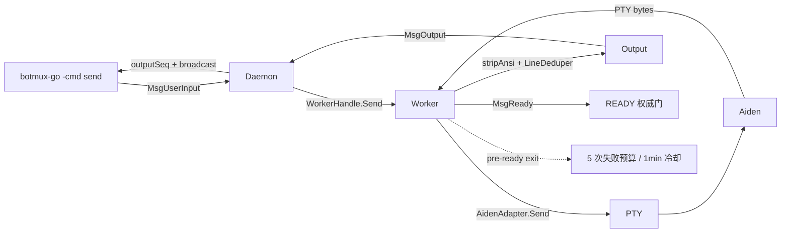

# botmux-go V5 技术设计文档 - Aiden CLI 基础闭环与可靠输出链路

> **版本**: V5 候选版
> **日期**: 2026-08-31
> **状态**: 代码与自动化测试完成；真实 Aiden 验收被上游模型权限阻塞
> **V4 文档**: [v4-architecture.md](v4-architecture.md)

---

## 一、目标与边界

V5 聚焦一件事：让 botmux-go 能稳定管理 Aiden CLI 的基础输入输出闭环。

### 1.1 交付目标

1. Aiden 进程通过 PTY 启动，支持模型和工作目录配置。
2. Worker 只有收到显式 `MsgReady` 后才进入 READY。
3. 单行、多行、长文本和中文输入不会被截断或改写为空格。
4. 文本写入失败有限重试，Enter 提交后通过 PTY 活动确认。
5. CLI 客户端持续打印本轮全部输出，不在第一条 `MsgOutput` 后退出。
6. 输出通知不轮询、不忙等、不回放本轮发送前的历史。
7. ANSI 清洗不泄漏控制序列，去重不删除重复代码或最终答案。
8. 启动失败 Worker 最多连续拉起 5 次，随后冷却 1 分钟。

### 1.2 非目标

- Aiden 原生 `--resume <sessionId>`
- Worker 内部 CLI restart loop
- 结构化 transcript / turn completed
- systemHints 注入
- Claude/Codex/CoCo/Gemini Adapter
- OverlayFS、可操作终端和 i18n

这些能力按原路线留给 V6 及以后。

---

## 二、V1-V5 演进

| 版本 | 核心能力 | 主要状态权威 |
|------|----------|--------------|
| V1 | Daemon + Worker + Mock Adapter | 内存 Session |
| V2 | JSON 持久化、Worker 重连、tmux | SessionStore |
| V3 | SessionMeta/WorkerHandle 解耦、Monitor 自愈 | Session 状态机 |
| V4 | HTTP API + Dashboard | Daemon 公共方法 |
| V5 | Aiden PTY、可靠输入、事件输出、真 READY | 显式协议事件 + output cursor |

---

## 三、整体架构



### 3.1 关键原则

- TCP 建连只表示传输通道存在，不表示 CLI 可输入。
- `MsgReady` 是 READY 的唯一权威信号。
- output cursor 表示逻辑输出位置，不能使用环形 slice 长度代替。
- PTY 活动只能作为提交证据，不能等价为模型回合终态。
- 没有结构化证据时，日志只报告事实，不声称模型一定在思考。

---

## 四、V5 PR 清单

| PR | 内容 | 状态 |
|----|------|------|
| V5-PR-A | PTY/Bash 基础后端，输出缓冲扩容 | 完成 |
| PR1 | `outputNotifyCh` 事件通知替代 200ms 轮询 | 完成 |
| PR4 | CLI 持续读取全部 `MsgOutput` | 完成 |
| PR1-B | 单调 output cursor + close-and-swap 广播 | 完成 |
| PR2 | 输入后的静默期分级诊断 | 完成 |
| PR6 | READY 仅由 `MsgReady` 驱动 | 完成 |
| P0 Follow-up | pre-ready exit 纳入重试预算 | 完成 |
| PR3-A | 多行、UTF-8 分块、short write、Send 串行化 | 完成 |
| PR3-B | 文本有限重试、Enter PTY 活动确认 | 完成 |
| PR5 | ANSI 状态机解析、保守 LineDeduper | 完成 |
| PR7 | E2E 与文档收口 | 部分完成：真实 Aiden 被上游模型权限阻塞 |

---

## 五、输出通知

### 5.1 问题

旧实现每 200ms 轮询 `SnapshotOutput()`：

- 无输出时仍持续唤醒。
- 新客户端从 `seen=0` 开始，会回放历史。
- 环形缓冲截断后，slice 长度不再是稳定游标。
- 容量 1 的普通 channel 不是广播，多客户端会竞争事件。

### 5.2 单调 cursor

`SessionMeta` 为每条输出递增 `outputSeq`：

```go
type SessionMeta struct {
    LastOutput []string
    outputSeq uint64
    outputNotifyCh chan struct{}
}
```

订阅者在发送输入前取得 `(cursor, notifyCh)`，后续通过
`SnapshotOutputSince(cursor)` 只读取本轮新增输出。

### 5.3 close-and-swap 广播

每次新增输出：

1. 保存当前通知 channel。
2. 创建下一代 channel。
3. 关闭旧 channel，唤醒全部订阅者。

消费者不再执行 re-arm，因此没有自激 busy loop。

---

## 六、READY 与启动失败治理

### 6.1 READY 握手

旧逻辑在 Worker 首条 TCP 消息到达后直接 `markReady()`。Aiden 即使先输出
启动错误，也会被 Daemon 误判为 READY。

V5 将状态转换收敛为：

```text
TCP connected        -> 仅绑定 WorkerHandle.Conn
MsgOutput/MsgError   -> 记录输出或错误，不 READY
MsgReady             -> markReady + StatusReady
```

### 6.2 启动风暴保护

以下事件计入 startup failure：

- Worker 未 READY 就退出
- READY 等待 10 秒超时
- `cmd.Start()` 失败

同一 Worker 代际最多计数一次。连续失败达到 5 次后暂停拉起 1 分钟。
只有显式 `MsgReady` 才清空失败预算。

旧 Worker 的退出和超时回调必须先验证 handle 仍是当前代际，避免污染新 Worker。

---

## 七、Aiden 输入可靠性

### 7.1 启动模式

本机 Aiden 1.8.45 只配置了 `xLauncherSelections.codex`，没有传统模式所需的
`model_configs`。Adapter 因此使用当前可用的 Aiden X 启动协议：

```text
aiden x codex --dangerously-bypass-approvals-and-sandbox \
  --no-alt-screen -C <workingDir> --model <model>
```

### 7.2 不使用 bracketed paste

官方 Aiden Adapter 明确说明 Aiden 不启用 bracketed-paste mode。直接发送
`\x1b[200~...\x1b[201~` 会把控制序列显示成普通文本。

V5 使用官方同源策略：

1. 原样写入文本。
2. 等待 200ms。
3. 单独写入 Enter。

### 7.3 多行与长输入

- `CRLF` / `CR` 归一为 `LF`
- 保留内部换行和缩进
- 去除末尾多余换行，防止提前提交
- 每块最多 4KB
- chunk 边界不切断 UTF-8 rune
- chunk 间隔 5ms
- `sendMu` 保证多个 Send 不交错

### 7.4 文本写重试

写入返回 `n < len(data)` 时继续写剩余内容。发生错误时只重试尚未写入的后缀，
不会重新发送整个 prompt。单次写入最多尝试 3 次。

### 7.5 Enter 确认

Worker 读取到新的 PTY 输出后调用 `CliOutputObserver.NotifyOutput()`。
AidenAdapter 在每次 Enter 前取得活动代际：

```text
subscribe PTY activity
send Enter
wait up to 2s
  activity advanced -> confirmed
  timeout           -> retry Enter
```

最多发送 3 次 Enter。仍无活动时返回显式错误：

```text
aiden submit not confirmed after 3 Enter attempts
```

该信号是最佳可用证据，不是 transcript 级 exactly-once 证明。

---

## 八、静默期可观测性

成功开始 Send 后，Worker 建立 130 秒观察窗口：

| 条件 | 状态 |
|------|------|
| 静默不足 15 秒 | 不打印 |
| 静默达到 15 秒，尚无输出 | `waiting_for_model_output` |
| 已有输出后再次静默 | `output_quiet` |
| 静默达到 60 秒 | `possible_pty_stall` |

日志同时包含：

- `idle`
- `since_input`
- `output_seen`
- `raw`
- `emitted`
- `pty_read_pending`

---

## 九、ANSI 与去重

### 9.1 ANSI 状态机

正则替换升级为确定性解析，支持：

- CSI / SGR
- OSC 与 OSC hyperlink
- DCS / SOS / PM / APC
- charset escape
- 截断控制序列
- cursor-forward 空格恢复

普通 UTF-8 文本原样保留。

### 9.2 保守去重

普通文本不再进入全局 seen 集合，因此以下内容允许重复：

- `}`
- `OK`
- 重复代码行
- 重复错误栈
- 最终答案

只有以明确 spinner/status 符号开头的动态状态行才做归一化去重。

---

## 十、验收结果

### 10.1 自动化

```text
go test ./...       PASS
go test -race       PASS（相关 package）
go build ./...      PASS
go vet ./...        PASS
```

### 10.2 E2E

| Case | 结果 |
|------|------|
| Mock 单次发送连续三条输出 | PASS |
| 两个客户端同时订阅同一 Session 输出 | PASS |
| 新 send 不回放历史输出 | PASS |
| Bash PTY 连续两轮发送 | PASS |
| Bash PTY 静默日志 | PASS |
| Aiden 启动失败不误报 READY | PASS |
| Aiden 启动失败最多拉起 5 次后冷却 | PASS |
| 真实 Aiden 两轮模型对话 | BLOCKED：Aiden aiproxy 对 `codex` 返回空模型列表 |

真实终端诊断已经排除本地登录问题：

```text
bytecloud.auth.status       success (authenticated=true)
bytecloud.auth.get_jwt      success
codex.gateway.models.load   failure
```

Aiden 最终错误为：

```text
Aiden aiproxy models API returned an empty model list for codex.
```

这发生在 Codex 子进程与 PTY 输入链路建立之前，属于账号模型权限或 Aiden
aiproxy 服务端配置问题。botmux-go 正确保持非 READY，按预算重试 5 次后冷却，
测试脚本随后关闭失败 Session。

---

## 十一、用户终端最终验收

上游模型权限恢复后，在非 Agent 沙箱终端执行：

```bash
bash /Users/bytedance/botmux-go/scripts/v5_aiden_e2e.sh
```

验收要求：

1. `new` 只在 Aiden 可用后返回 READY。
2. 第一轮出现多条流式输出。
3. 第二轮不回放第一轮历史。
4. Daemon 日志没有 `submit not confirmed`。
5. 没有高频 Worker 重启。

---

## 十二、后续路线

V6 优先事项：

1. `MsgTurnCompleted`，CLI 根据终态退出，120 秒 deadline 仅作保险。
2. Aiden 原生 `--resume <sessionId>`。
3. Worker 内部 CLI restart loop。
4. 结构化会话历史与 systemHints。

V7 扩展 Claude/Codex/CoCo/Gemini Adapter。

V8 再考虑 OverlayFS、可操作终端、Dashboard 增强和 i18n。
