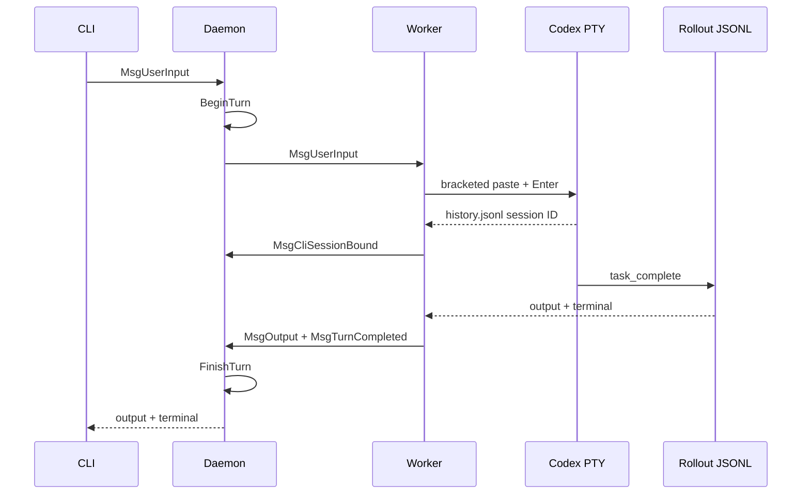

# botmux-go V6 技术设计 - Native Codex 单轮闭环

> **日期**: 2026-09-08
> **状态**: 自动化与真实 Codex 验收完成
> **前置版本**: [V5](v5-architecture.md)

## 目标与边界

V6 增加原生 Codex CLI adapter，交付可靠的单轮开发工作流：

- fresh launch 支持 model、working directory 和可选 `--profile`；
- 多行输入经 bracketed paste 投递，并通过 `history.jsonl` 增量记录确认；
- rollout JSONL 是最终输出与回合终态的权威来源；
- native Codex session ID 持久化，重启使用精确 `codex resume <id>`；
- 每个 Codex session 同时只允许一个 active turn。

不包含 type-ahead、`/adopt`、Codex App/RPC。

## V5 到 V6

V5 依赖 PTY 文本和 Aiden 活动确认。V6 保留 PTY 仅用于启动 READY 与诊断，增加以下结构化权威：

| 需求 | V6 权威来源 |
|---|---|
| 输入被 Codex 接收 | `$CODEX_HOME/history.jsonl` 新增匹配记录 |
| 输入归属 | Codex PID 打开的 rollout 文件 |
| 最终回答 | rollout 的 `event_msg.task_complete.last_agent_message` |
| 回合失败 | rollout 的 `turn_aborted` 或 adapter failed terminal |
| 会话恢复 | 持久化的 native Codex UUID |

## 核心时序

重启时 daemon 将保存的 `CliSessionID` 放入 Worker 环境；adapter 使用 `codex resume <id>`。resume 保留已选 `--profile`，因为 ArkCLI 等 provider 需要 profile 恢复鉴权上下文；仍不传 `--model`，避免覆盖原会话模型选择。

## Profile

仅发现 `${CODEX_HOME:-~/.codex}/*.config.toml` 的合法名称。profile 内容不会被读取、记录或通过 API 返回。fresh launch 接受 bot 默认或创建会话时的覆盖值；resume 重用已持久化的 profile。

## 失败处理

| 场景 | 行为 |
|---|---|
| profile 不存在/名称非法 | Worker spawn 前拒绝 |
| Codex 未 READY | 45 秒超时或进程退出失败 |
| history 未确认 | 仅重试 Enter，绝不重发 paste body |
| rollout 缺失/不可读 | failed terminal |
| 第二条并发 Codex 输入 | `session already has an active turn` |
| Worker submit 失败 | failed terminal 并释放 daemon gate |

## 验收

已通过 `go test ./...`、`go test -race ./...`、`go build ./...`、`go vet ./...`。fake Codex 测试覆盖 fresh/profile、multiline、history ownership、rollout final/terminal 和 resume argv。

真实账号验收于 2026-09-08 执行 [v6_codex_e2e.sh](../../scripts/v6_codex_e2e.sh)：fresh 回合返回 `CODEX_V6_ONE` 与 `CODEX_V6_TWO`；daemon 重启后 native resume 回答了两个 marker。脚本会等待 daemon 监听并在恢复期重试 worker-not-ready。

## 后续

type-ahead 需要多输入与终态归因队列；`/adopt` 需要 PID/rollout 认领交互；RPC 要等 app-server 协议稳定后单独引入。
