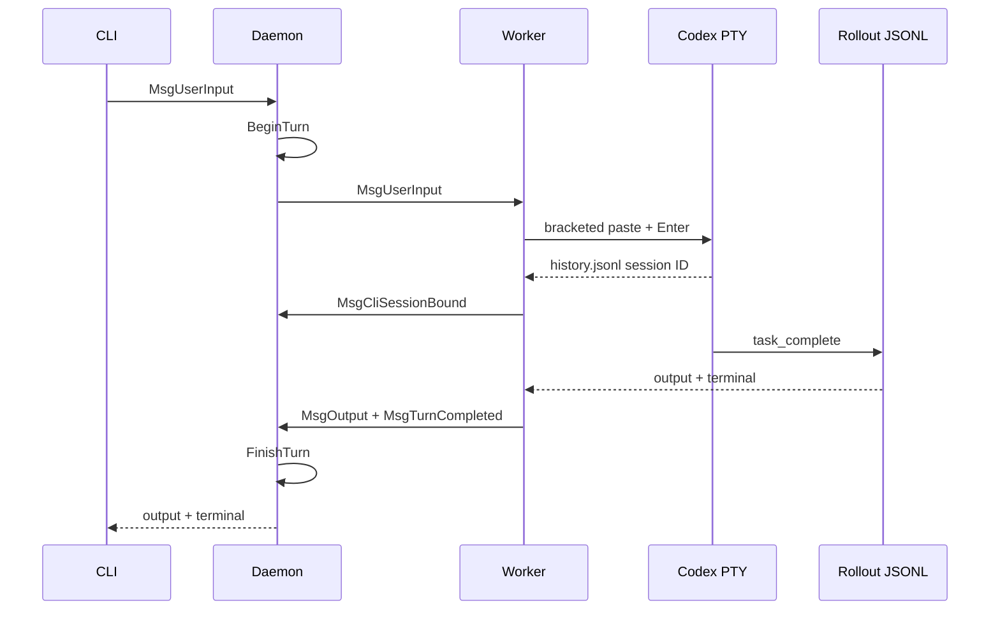

# botmux-go V6 技术设计 - Native Codex 单轮闭环

> **日期**: 2026-09-08
> **状态**: 自动化与真实 Codex 验收完成
> **前置版本**: [V5](v5-architecture.md)

## 目标与边界

V6 增加原生 Codex CLI adapter，交付可靠的单轮开发工作流：

- fresh launch 支持 model、working directory 和可选 `--profile`；
- 多行输入经 bracketed paste 投递，并通过 `history.jsonl` 增量记录确认；
- rollout JSONL 是最终输出与回合终态的权威来源；
- native Codex session ID 持久化，重启使用精确 `codex resume <id>`；
- 每个 Codex session 同时只允许一个 active turn。

不包含 type-ahead、`/adopt`、Codex App/RPC。

## V5 到 V6

V5 依赖 PTY 文本和 Aiden 活动确认。V6 保留 PTY 仅用于启动 READY 与诊断，增加以下结构化权威：

| 需求 | V6 权威来源 |
|---|---|
| 输入被 Codex 接收 | `$CODEX_HOME/history.jsonl` 新增匹配记录 |
| 输入归属 | Codex PID 打开的 rollout 文件 |
| 最终回答 | rollout 的 `event_msg.task_complete.last_agent_message` |
| 回合失败 | rollout 的 `turn_aborted` 或 adapter failed terminal |
| 会话恢复 | 持久化的 native Codex UUID |

## 核心时序

重启时 daemon 将保存的 `CliSessionID` 放入 Worker 环境；adapter 使用 `codex resume <id>`。resume 保留已选 `--profile`，因为 ArkCLI 等 provider 需要 profile 恢复鉴权上下文；仍不传 `--model`，避免覆盖原会话模型选择。

显式用户/session close 仍调用 `CloseSession` 并持久化 `closed:true`。相反，daemon 的优雅 `Stop` 保留所有 open session 记录及其 native session ID：它向当前 worker 异步发送 `restart_worker` 请求资源清理，给予 3 秒退出窗口并强杀残留 worker，最后才取消 daemon context。该清理不标记 session closed，因此新 daemon 可 restore 并由 session monitor 启动 replacement worker 完成 native resume。

## Worker 实例围栏

daemon 为每个 `WorkerHandle` 生成一个临时的随机 128-bit instance nonce，并通过 `BOTMUX_WORKER_INSTANCE_ID` 传给该 worker。nonce 不持久化；daemon 重启会生成新的 worker，因此旧 worker 不能重新取得原实例身份。

worker 在 `MsgReady` 中携带该 nonce。首次连接和重连均先在未发布的私有连接上完成 `READY -> ACK("worker_ready")` 握手；只有 ACK 写入成功后，双方才发布或替换该连接，并将 worker 标为 ready。

daemon 仅接受同时满足下列条件的 READY：session 仍为当前且未关闭、该 session 当前的精确 `WorkerHandle` 仍由该 session owner 持有、且 nonce 与 handle 预期值完全相同。缺少 nonce、非预期 worker、已替换 session 或 nonce 不匹配均返回错误而不发布连接。被拒绝的初始或重连 worker 会清理 CLI/连接并停止重连，避免陈旧 worker 反复争用。

此 nonce 是 daemon 内本机 worker 生命周期的实例围栏，不提供远程身份认证。`Closed` 状态仅由 daemon 落盘；同一 session ID 的重建、关闭和文件操作同时受当前 `SessionMeta` 指针与按 ID 文件锁保护。worker 只做资源清理，绝不写入 closed 状态。

## Turn Cancellation

用户通过 Dashboard 的 Cancel 按钮或 POST cancel API 取消当前回合时，daemon/worker adapter 会在内部向 Codex TUI 写入 Esc；native `turn_aborted` 是该回合的权威终态，但 session 保持可用，不会关闭或丢失其 native session ID。

取消后 10 秒内必须产生 terminal。若未收到 terminal，daemon 只生成一次 `status=failed`、`code=codex_cancel_timeout` 的终态，并释放 active turn；重复超时和迟到事件不会产生第二个 terminal。

worker 因取消退出时仅清理其资源，绝不将 session 落盘为 closed。取消或 graceful daemon shutdown 的 `restart_worker` 清理都不会关闭 session；session monitor 会使用持久化的 native session ID 启动 replacement worker，并执行 `codex resume <native-session-id>`。旧 worker 在 replacement 后迟到的输出或 terminal 事件会因 Worker 实例围栏被忽略，不能影响当前 worker 或新回合。

## Profile

仅发现 `${CODEX_HOME:-~/.codex}/*.config.toml` 的合法名称。profile 内容不会被读取、记录或通过 API 返回。fresh launch 接受 bot 默认或创建会话时的覆盖值；resume 重用已持久化的 profile。

## 失败处理

| 场景 | 行为 |
|---|---|
| profile 不存在/名称非法 | Worker spawn 前拒绝 |
| Codex 未 READY | 45 秒超时或进程退出失败 |
| history 未确认 | 仅重试 Enter，绝不重发 paste body |
| rollout 缺失/不可读 | failed terminal |
| 第二条并发 Codex 输入 | `session already has an active turn` |
| Worker submit 失败 | failed terminal 并释放 daemon gate |

## 验收

已通过 `go test ./...`、`go test -race ./...`、`go build ./...`、`go vet ./...`。fake Codex 测试覆盖 fresh/profile、multiline、history ownership、rollout final/terminal 和 resume argv；daemon shutdown 覆盖确认 `restart_worker` 清理、worker 退出后取消 context，以及 open persistence/native ID 可被 restore。

真实账号验收于 2026-09-08 执行 [v6_codex_e2e.sh](../../scripts/v6_codex_e2e.sh)：fresh 回合返回 `CODEX_V6_ONE` 与 `CODEX_V6_TWO`；daemon 重启后 native resume 回答了两个 marker。脚本会在 resume launch 前停止并等待先前的 daemon child，避免陈旧 PID/端口交接竞争；恢复期仍会重试 worker-not-ready。

## 后续

type-ahead 需要多输入与终态归因队列；`/adopt` 需要 PID/rollout 认领交互；RPC 要等 app-server 协议稳定后单独引入。
